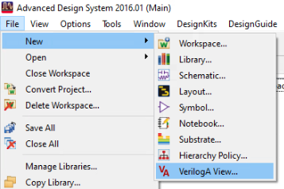
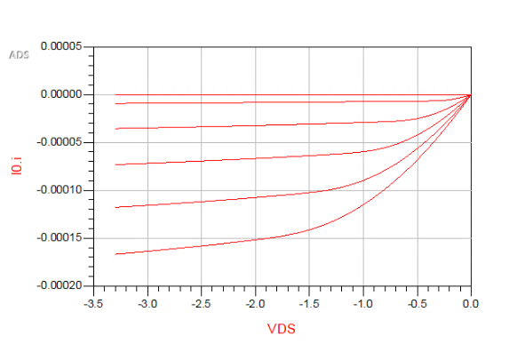

# Advanced Design System (ADS) EKV v2.6 Model Tutorial
This tutorial will serve as an introduction to implementing the EKV v2.6 Model into ADS. We will be using the CMOS 0.5um Parameter Set found on the EFPL website [^1]

## Background
There are not many full tutorials accessable online on how to use the EKV Model within ADS, those that can be found don't provide additional information on how parameter values were obtained. This tutorial should help the reader to understand how to implement their own models using Verilog-A in detail. There is a useful GitHub Repository where I was able to grabe Verilog-A code for the EKV Model [^2] Although this repository that holds the Verilog-A code is very useful and the only publicly available code I could find for the EKV Model, it does not use any of the official parameter sets found on EFPL's website and does not specify other information regarding using the Model. Thus, taking their Verilog-A code and switching out the parameters for the half micron parameter set, I was able to simulate models for both the NMOS and PMOS devices. 

*Disclosure: I do not own any of the code or model cards referenced within this tutorial. This document is meant to assist the reader by providing valualbe information that would otherwise not be all in the same tutorial. Links to all resources will be available at the end of the document.*

# Creating the EKV Model in ADS
This section will contain information on how to build the NMOS and PMOS model within ADS, you will build the Schematic, Symbol, write and compile the Verilog-A code and should be able to view the Design Parameters for the Model. 

## N-Type MOSFET Model
1. Open ADS and navigate to a new workspace, you can use any name for this workspace.

2.  In your newly created workspace, we will need to first add the Verilog-A code to a new cell.   
> 1. To do this, navigate to *File* -> *New* -> *VerilogA New*
>
>    
>
> 2. Name the cell "*nmos_ekv_va*" and click *OK*

> 4. Once the Verilog-A file is created unde the cell named *nmos_ekv_va*, the file should open with template code. Remove the template code in the file and paste the [Verilog-A NMOS Code](https://github.com/J0NTrollston/ADS-EKV2.6-Model/blob/main/0.5um_CMOS_Parameters/nmos/nmos_ekv_va.va) into the Verilog-A file. Save and Exit.

3. Next, we will create a Schematic under the *nmos_ekv_va* cell.
> 1. Right Click on the *nmos_ekv_va* cell and choose "*New Schematic*"
> 2. A window will open, verify that in the Cell naming box it contains "*nmos_ekv_va*"
> 3. Click *OK*
> 4. In the new window, navigate to the top ribbon and click on the *Insert Pin* box. Our model uses 4 pins labeled *d*, *g*, *s*, and *b* so we will need to add 4 of these pins.
>
>    
>
>    While placing these down, you can use the rotate button on the same tool ribbon.
>
>    
>    
>    After placing your pins down, you will need to name them with respect to how they are named in the Verilog-A file. The Verilog-A code declares the model [(Code Line Reference)](https://github.com/J0NTrollston/ADS-EKV2.6-Model/blob/18412c61c6d320f61304ae781417ded005d9e792/0.5um_CMOS_Parameters/nmos/nmos_ekv_va.va#L110C1-L110C29) as "*module nmos_ekv_va(d,g,s,b);*" meaning we will need to name the pins the exact same way. We can do this by Double Clicking one of the pins you placed down to go into edit mode. For example, below is how the "*g*" pin's edit window should look like.
>
>    
>
>    
> 5. Once the 4 pins are added, your Schematic should only have 4 pins named *d*, *g*, *s*, and *b*.
> 
>    
>
>    Click Save and Exit

6. The last file we will need to create is the Symbol for the *nmos_ekv_va* cell.
> 1. Right Click on the *nmos_ekv_va* cell and choose "*New Layout*"
> 2. A window will open, verify that in the Cell naming box it contains "*nmos_ekv_va*"
> 3. Click *OK*
> 4. Another window will pop up showing you different ways to change your pin setup. You don't need to change the settings and can Click *OK*
> 5. You will need to create the N-Type MOSFET Symbol. Use the Thick Line Tool and rotate the 4 pins to complete the Symbol.
>
>    
>
>    For aesthetic reasons, you can set your line to "*Thick*"
>
>    
>
>    Once your NMOS Symbol looks the same, you can Save and Exit

7. Now that we have all 3 files created, we need to compile our Verilog-A code.
> 1. Right Click on the Verilog-A file we created initially and Click Compile Verilog.
>     
>    
>
>    You should get a pop up box stating that the code was compiled without errors.
>    
> 3. To confirm that the model is using the given parameters, open the Symbol file we created and navigate to *File* -> *Design Parameters*
>
>    
>
> 4. Once the Definition Window opens, you should see a list of parameters. Using the Verilog-A file, ADS will pull the parameters used and save them for you.
>
>    
> 
> 6. Click *Apply* on the Definition Window and then Save and Close the Symbol Window.
>    After this step, you will have fully created your N-Type EKV v2.6 MOSFET Model
>    Now you may move on to the P-Type Model

## P-Type MOSFET Model
PMOS Model:
I will quickly go over the PMOS Model as most of the steps are the same

Create a new cell named pmos_ekv_va and paste the code %% code link for pmos va file%% in a new veriloga file.
Save and then create the schematic and symbol views. The symbol for your pmos model should look the same as below.

%% pmos symbol %%

Once the pmos cell contains the 3 files as well, go ahead and compile the veriloga code and check the design parameters. Below is what the Definition window should look like.
Click OK and now you have your CMOS models created. Next let's test them out.
%% pmos Definition window of parameters %%

### What about the values used in the Models?

# Simulation of the Models

## N-Type MOSFET Simulation
In order to simulate our models, we will need to create a new cell. Create a new schematic and in the cell box, rename your cell to "nmos_ekv_va_SIM"
In the schematic view, navigate to the Component Library Icon and under Workspace Libraries you will need to choose "nmos_ekv_va". Place the model in the schematic.

Next you will need to add the following components shown in the figure below. All required variables are displayed.

%% show sim layout of nmos %%

Once your simulation schematic looks like the one shown, you will need to complete one more step. Currently, the nmos schematic you placed down is an instance. This means you will need to reference the model before simulation.
Select the nmos instance on the schematic and Choose View for Simulation from the top ribbon. You will need to choose the veriloga file to use for simulation.

Your schematic should now have the text "veriloga" above the nmos if done correctly as shown below.

%% nmos simulation veriloga %%

Save and click simulate. You will want to plot the Drain Current vs the Voltage from Drain to Source (i.e. I_D vs V_DS)

%% show curve for nmos %%

## P-Type MOSFET Simulation
We will do the same for the pmos simulation, rename your cell accordingly and replicate the schematic simulation below.

%% schematic for pmos simulaiton %%

# Creating a simple Inverter
## Create Inverter Schematic
## Simulate Inverter section
Later, I will add this section for the CMOS inverter using both models that we created. 

[^1]: [EFPL CMOS 0.5um Parameter Set](https://www.epfl.ch/labs/iclab/ekv/verilog-a/0_5um_cmos_par/)
[^2]: [GitHub FOSS EKVv2.6](https://github.com/ekv26/model)
