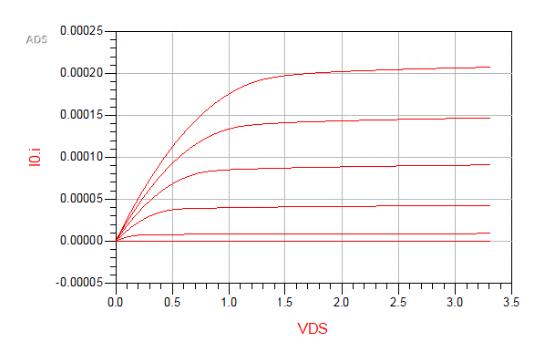

# Advanced Design System (ADS) EKV v2.6 Model Tutorial
This tutorial will serve as an introduction to implementing the EKV v2.6 Model into ADS. We will be using the CMOS 0.5um Parameter Set found on the EFPL website [^1]

## Background
There are not many full tutorials accessable online on how to use the EKV Model within ADS, those that can be found don't provide additional information on how parameter values were obtained. This tutorial should help the reader to understand how to implement their own models using Verilog-A in detail. There is a useful GitHub Repository where I was able to grabe Verilog-A code for the EKV Model [^2] Although this repository that holds the Verilog-A code is very useful and the only publicly available code I could find for the EKV Model, it does not use any of the official parameter sets found on EFPL's website and does not specify other information regarding using the Model. Thus, taking their Verilog-A code and switching out the parameters for the half micron parameter set, I was able to simulate models for both the NMOS and PMOS devices. 

*Disclosure: I do not own any of the code or model cards referenced within this tutorial. This document is meant to assist the reader by providing valualbe information that would otherwise not be all in the same tutorial. Links to all resources will be available at the end of the document.*

# Creating the EKV Model in ADS
This section will contain information on how to build the NMOS and PMOS model within ADS, you will build the Schematic, Symbol, write and compile the Verilog-A code and should be able to view the Design Parameters for the Model. 

## N-Type MOSFET Model
1. Open ADS and navigate to a new workspace, you can use any name for this workspace.
> 1. In your newly created workspace, we will need to first add the Verilog-A code to a new cell.   
>   To do this, navigate to *File* -> *New* -> *VerilogA New*
>   

Create a new cell named "nmos_ekv_va" and paste the code located [Verilog-A NMOS](https://github.com/J0NTrollston/ADS-EKV2.6-Model/blob/main/0.5um_CMOS_Parameters/nmos/nmos_ekv_va.va)

Next, we will create a new schematic under the cell we created. Go ahead and add 4 pins and place them on the schematic view. These pin names will need to match what are used in the nmos_ekv_va.va file (d,g,s,b).
Below is a screenshot of what yours should look like. When this is complete, save and close the schematic.

Under the same cell, create a new symbol. A Symbol Generator box will pop up, click okay and modify the symbol to look like an N-Type MOSFET.
Below is an example of what yours should look like. Save and close the symbol view once this is complete.

%% show example of nmos symbol %%

Now that we have all 3 files created, right click on the veriloga file we created initially and click Compile Verilog.
You should get a message stating that the code was compiled without errors. To confirm this, open the symbol view we created and navigate to File -> Design Parameters

The image below is what your Definition window should look like. Using the VerilogA file, ADS will pull the parameters used and save them for you.
Click OK on the Definition window to close.
%% nmos parameter view %%

## P-Type MOSFET Model

# Simulation of the Models

## N-Type MOSFET Simulation

## P-Type MOSFET Simulation

# Creating a simple Inverter

Using the 0.5um EKV Model in ADS

As we will be using both nmos and pmos, we need to create 2 models. Let's first focus on the NMOS Model as the steps will essentially be the same.

PMOS Model:
I will quickly go over the PMOS Model as most of the steps are the same

Create a new cell named pmos_ekv_va and paste the code %% code link for pmos va file%% in a new veriloga file.
Save and then create the schematic and symbol views. The symbol for your pmos model should look the same as below.

%% pmos symbol %%

Once the pmos cell contains the 3 files as well, go ahead and compile the veriloga code and check the design parameters. Below is what the Definition window should look like.
Click OK and now you have your CMOS models created. Next let's test them out.
%% pmos Definition window of parameters %%

Simulating your models:

In order to simulate our models, we will need to create a new cell. Create a new schematic and in the cell box, rename your cell to "nmos_ekv_va_SIM"
In the schematic view, navigate to the Component Library Icon and under Workspace Libraries you will need to choose "nmos_ekv_va". Place the model in the schematic.

Next you will need to add the following components shown in the figure below. All required variables are displayed.

%% show sim layout of nmos %%

Once your simulation schematic looks like the one shown, you will need to complete one more step. Currently, the nmos schematic you placed down is an instance. This means you will need to reference the model before simulation.
Select the nmos instance on the schematic and Choose View for Simulation from the top ribbon. You will need to choose the veriloga file to use for simulation.

Your schematic should now have the text "veriloga" above the nmos if done correctly as shown below.

%% nmos simulation veriloga %%

Save and click simulate. You will want to plot the Drain Current vs the Voltage from Drain to Source (i.e. I_D vs V_DS)

%% show curve for nmos %%

We will do the same for the pmos simulation, rename your cell accordingly and replicate the schematic simulation below.

%% schematic for pmos simulaiton %%

# Simulate Inverter section
Later, I will add this section for the CMOS inverter using both models that we created. 

[^1]: [EFPL CMOS 0.5um Parameter Set](https://www.epfl.ch/labs/iclab/ekv/verilog-a/0_5um_cmos_par/)
[^2]: [EFPL CMOS 0.5um Parameter Set](https://github.com/ekv26/model)
