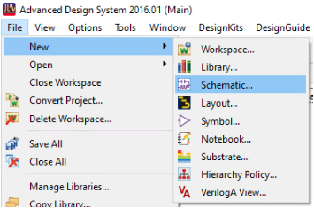
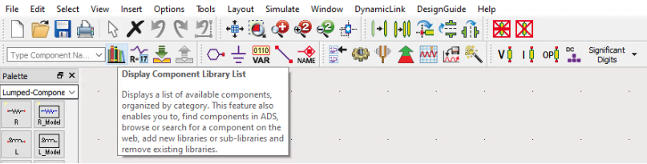
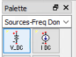
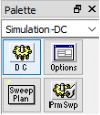
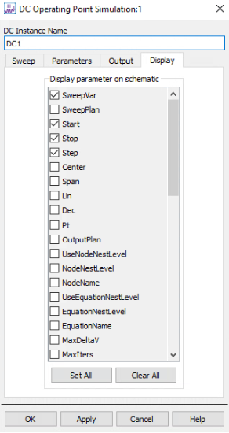
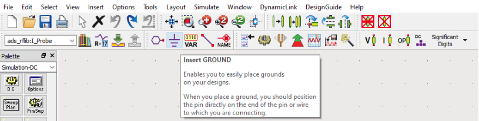
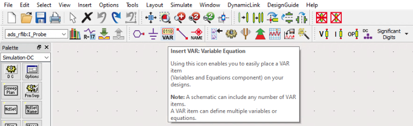
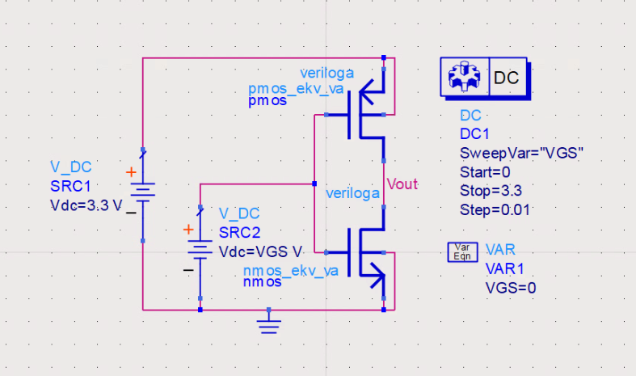
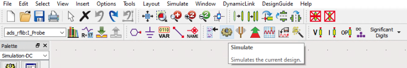
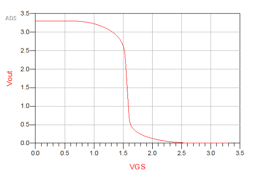

# Incomplete Tutorial

# Advanced Design System (ADS) CMOS Inverter Tutorial
Building off from the previous tutorial showing how to create the [EKV MOSFET Model](https://github.com/J0NTrollston/ADS-EKV2.6-Model/tree/dd347d0c8e608031fab5bb2bc43bb72b4c067ee1/EKV_Models), we will go over how to create the CMOS Inverter and simulate it within You can also follow the steps through the tutorial on [YouTube](https://youtu.be/B8LCLi1V34s).

## Table of Contents

[Creating a simple Inverter](https://github.com/J0NTrollston/ADS-EKV2.6-Model/tree/main/CMOS_Inverter#creating-a-simple-inverter)

* [Create Inverter Schematic](https://github.com/J0NTrollston/ADS-EKV2.6-Model/tree/main/CMOS_Inverter#create-inverter-schematic)

[Simulate Inverter section](https://github.com/J0NTrollston/ADS-EKV2.6-Model/tree/main/CMOS_Inverter#simulate-inverter)

# Creating a simple Inverter
By using the previous NMOS and PMOS Models created using the Verilog-A code, we will create the CMOS Inverter in the ADS Schematic. 

## Create Inverter Schematic
1. In the same Workspace that you created the EKV Models, you will want to create a new Schematic. You can do this by Clicking *File* and navigating to *Schematic*
>
>    

2. Pull the NMOS and PMOS Models and place them into the Schematic
> 1. Click on the Display Component Library List on the top ribbon to grab the Models.
> 
>    
>
> 2. This will open a Component Library Window which will have all of your libraries available in your Workspace. On the left, you will see a dropdown menu called All Libraries. If not already expanded, open this dropdown menu and Click on Workspace Libraries. To the right you will see the models. Double Click on the Component called nmos_ekv_va and place it down within the Schematic, then do the same for the pmos_ekv_va Component.

3. Now that we have our EKV Models in the Schematic, we will need to add the other components to test the Inverter.
> 1. Within the Schematic you will have the Palette to the left, use the dropdown to find the *Sources-Freq Domain* Palette. Once you have opened this menu, grab the 2 V_DC Components.
>
>    
>
> 2. Go to the *Simulation-DC* Palette and grab the *D C* Components.
>
>    
>
>    After you placed the component, Double Click the Component and Open the Display Tab. Here is where you can choose what parameters are displayed on the Schematic. Choose SweepVar, Start, Stop and Step.
>
>    
>
> 3. There are some other items that we will need such as the *Ground* and *VAR* Components.
>    Grab one *Ground*
>
>    
>
>    And you will need one *VAR* Component
>
>    

4. Now that we have the components requred, we will need to put them together.
> 1. Using the Wire Tool, connect the components as seen below. Notice that the connection wire between the two models has been given the name "*Vout*" to make it easier when displaying the voltage later. To name a connection, use the Name Tool in the same ribbon where the Wire Tool can be found.
>    
>   
>
>   Once you have verified that your schematic has the same values as seen above, go ahead and save the Schematic and move on to simulating your design.

## Simulate Inverter
1. Let's plot the voltage out versus voltage from the gate.
> 1. Click the Simulate Tool located on the top ribbon
>
>    
>
>    After a couple of seconds, you will see 2 Windows open. As long as ther are no error messages or warnings, you may ignore the Logging Window. We will instead focus on the second window to plot our graph.
> 3. On the left in the Palette, you will need to Select the Rectangular Plot and place it within the Window. Before it can be placed, the Plot Traces & Attributes Window will open. You will want to Select the VGS and then Click ">>Add Vs..>>" to which another window will open. In the Select Independent Variable Window, you will need to Select "Vout" and Click OK. You will see the VGS vs Vout for the EKV Inverter. 
>
>    
