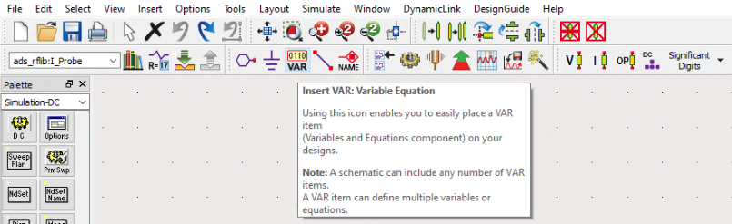

# Advanced Design System (ADS) EKV v2.6 Model Tutorial
This tutorial will serve as an introduction to implementing the EKV v2.6 Model into ADS. We will be using the CMOS 0.5um Parameter Set found on the EFPL website.[^1]

## Background
There are not many full tutorials accessable online on how to use the EKV Model within ADS, those that can be found don't provide additional information on how parameter values were obtained. This tutorial should help the reader to understand how to implement their own models using Verilog-A in detail. There is a useful GitHub Repository where I was able to grab the Verilog-A code for the EKV Model.[^2] Although this repository that holds the Verilog-A code is very useful and the only publicly available code I could find for the EKV Model, it does not use any of the official parameter sets found on EFPL's website[^3] and does not specify other information regarding using the Model. Thus, taking their Verilog-A code and switching out the parameters for the half micron parameter set, I was able to simulate models for both the NMOS and PMOS devices. 

*Disclosure: I do not own any of the code or model cards referenced within this tutorial. This document is meant to assist the reader by providing valualbe information that would otherwise not be all in the same tutorial. Links to all resources will be available at the end of the document.*

# Creating the EKV Model in ADS
This section will contain information on how to build the NMOS and PMOS model within ADS, you will build the Schematic, Symbol, write and compile the Verilog-A code and should be able to view the Design Parameters for the Model. 

## N-Type MOSFET Model
1. Open ADS and navigate to a new workspace, you can use any name for this workspace.

2.  In your newly created workspace, we will need to first add the Verilog-A code to a new cell.   
> 1. To do this, navigate to *File* -> *New* -> *VerilogA New*
>
>    
>
> 2. Name the cell "*nmos_ekv_va*" and click *OK*
>
> 3. Once the Verilog-A file is created unde the cell named *nmos_ekv_va*, the file should open with template code. Remove the template code in the file and paste the [Verilog-A NMOS Code](https://github.com/J0NTrollston/ADS-EKV2.6-Model/blob/main/0.5um_CMOS_Parameters/nmos/nmos_ekv_va.va) into the Verilog-A file. Save and Exit.

3. Next, we will create a Schematic under the *nmos_ekv_va* cell.
> 1. Right Click on the *nmos_ekv_va* cell and choose "*New Schematic*"
> 2. A window will open, verify that in the Cell naming box it contains "*nmos_ekv_va*"
> 3. Click *OK*
> 4. In the new window, navigate to the top ribbon and click on the *Insert Pin* box. Our model uses 4 pins labeled *d*, *g*, *s*, and *b* so we will need to add 4 of these pins.
>
>    
>
>    While placing these down, you can use the rotate button on the same tool ribbon.
>
>    
>    
>    After placing your pins down, you will need to name them with respect to how they are named in the Verilog-A file. The Verilog-A code declares the model [(Code Line Reference)](https://github.com/J0NTrollston/ADS-EKV2.6-Model/blob/18412c61c6d320f61304ae781417ded005d9e792/0.5um_CMOS_Parameters/nmos/nmos_ekv_va.va#L110C1-L110C29) as "*module nmos_ekv_va(d,g,s,b);*" meaning we will need to name the pins the exact same way. We can do this by Double Clicking one of the pins you placed down to go into edit mode. For example, below is how the "*g*" pin's edit window should look like.
>
>    
>
>    
> 5. Once the 4 pins are added, your Schematic should only have 4 pins named *d*, *g*, *s*, and *b*.
> 
>    
>
>    Click Save and Exit

6. The last file we will need to create is the Symbol for the *nmos_ekv_va* cell.
> 1. Right Click on the *nmos_ekv_va* cell and choose "*New Layout*"
> 2. A window will open, verify that in the Cell naming box it contains "*nmos_ekv_va*"
> 3. Click *OK*
> 4. Another window will pop up showing you different ways to change your pin setup. You don't need to change the settings and can Click *OK*
> 5. You will need to create the N-Type MOSFET Symbol. Use the Thick Line Tool and rotate the 4 pins to complete the Symbol.
>
>    
>
>    For aesthetic reasons, you can set your line to "*Thick*"
>
>    
>
>    Once your NMOS Symbol looks the same, you can Save and Exit

7. Now that we have all 3 files created, we need to compile our Verilog-A code.
> 1. Right Click on the Verilog-A file we created initially and Click Compile Verilog.
>     
>    
>
>    You should get a pop up box stating that the code was compiled without errors.
>    
> 3. To confirm that the model is using the given parameters, open the Symbol file we created and navigate to *File* -> *Design Parameters*
>
>    
>
> 4. Once the Definition Window opens, you should see a list of parameters. Using the Verilog-A file, ADS will pull the parameters used and save them for you.
>
>    
> 
> 6. Click *Apply* on the Definition Window and then Save and Close the Symbol Window.
>    After this step, you will have fully created your N-Type EKV v2.6 MOSFET Model
>    Now you may move on to the P-Type Model

## P-Type MOSFET Model
Creating the P-Type Model will be mostly the same steps.

1.  In the same workspace, we will need to first add the Verilog-A code to a new cell.   
> 1. To do this, navigate to *File* -> *New* -> *VerilogA New*
>
>    
>
> 2. Name the cell "*pmos_ekv_va*" and click *OK*
>
> 3. Once the Verilog-A file is created unde the cell named *pmos_ekv_va*, the file should open with template code. Remove the template code in the file and paste the [Verilog-A PMOS Code](https://github.com/J0NTrollston/ADS-EKV2.6-Model/blob/main/0.5um_CMOS_Parameters/pmos/pmos_ekv_va.va) into the Verilog-A file. Save and Exit.

3. Next, we will create a Schematic under the *pmos_ekv_va* cell.
> 1. Right Click on the *pmos_ekv_va* cell and choose "*New Schematic*"
> 2. A window will open, verify that in the Cell naming box it contains "*pmos_ekv_va*"
> 3. Click *OK*
> 4. In the new window, navigate to the top ribbon and click on the *Insert Pin* box. Our model uses 4 pins labeled *d*, *g*, *s*, and *b* so we will need to add 4 of these pins.
>    After placing your pins down, you will need to name them with respect to how they are named in the Verilog-A file. The Verilog-A code declares the model [(Code Line Reference)](https://github.com/J0NTrollston/ADS-EKV2.6-Model/blob/33d03b760786f93b5bcbb10d291e20373eda4eb6/0.5um_CMOS_Parameters/pmos/pmos_ekv_va.va#L110) as "*module pmos_ekv_va(d,g,s,b);*" meaning we will need to name the pins the exact same way. We can do this by Double Clicking one of the pins you placed down to go into edit mode. For example, below is how the "*g*" pin's edit window should look like.
>
>    
>
>    
> 5. Once the 4 pins are added, your Schematic should only have 4 pins named *d*, *g*, *s*, and *b*.
> 
>    
>
>    Click Save and Exit

6. The last file we will need to create is the Symbol for the *pmos_ekv_va* cell.
> 1. Right Click on the *pmos_ekv_va* cell and choose "*New Layout*"
> 2. A window will open, verify that in the Cell naming box it contains "*pmos_ekv_va*"
> 3. Click *OK*
> 4. Another window will pop up showing you different ways to change your pin setup. You don't need to change the settings and can Click *OK*
> 5. You will need to create the P-Type MOSFET Symbol. Use the Thick Line Tool and rotate the 4 pins to complete the Symbol.
>
>    
>
>    For aesthetic reasons, you can set your line to "*Thick*"
>
>    
>
>    Once your PMOS Symbol looks the same, you can Save and Exit

7. Now that we have all 3 files created, we need to compile our Verilog-A code.
> 1. Right Click on the Verilog-A file we created initially and Click Compile Verilog.
>     
>    
>
>    You should get a pop up box stating that the code was compiled without errors.
>    
> 3. To confirm that the model is using the given parameters, open the Symbol file we created and navigate to *File* -> *Design Parameters*
>
>    
>
> 4. Once the Definition Window opens, you should see a list of parameters. Using the Verilog-A file, ADS will pull the parameters used and save them for you.
>
>    
> 
> 6. Click *Apply* on the Definition Window and then Save and Close the Symbol Window.
>    After this step, you will have fully created your P-Type EKV v2.6 MOSFET Model

### What about the values used in the Models?
Using the FOSS EKV Model[^2] Verilog-A code, I started off with their default values for my parameters. Using the 0.5um parameter set from EFPL, I updated the default values to reflect the half micron technology that was to be simulated. The EFPL parameters[^1] did not contain all of the parameters found in the Verilog-A code but it did cover the more important values for any model. Below is a table that will show the source of the value used in my model. Lastly, there were some other external resources for some of the parameters which have listes sources.

| Parameter Name | FOSS Model | EFPL | Parameter Name | FOSS Model | EFPL | Other | Parameter Name | FOSS Model | EFPL | Parameter Name | FOSS Model | EFPL | Other |
| --- | --- | --- | --- | --- | --- | --- | --- | --- | --- | --- | --- | --- | --- |
|	TYPE	|	x	|		|	HDIF	|		|	x	|		|	PHI	|		|	x	|	xd_gmin	|		|		|	SIMetrix[^5]	|
|	Noise	|	x	|		|	AVTO	|	x	|		|		|	KP	|		|	x	|	xd_xjbv	|	x	|		|		|
|	Trise	|	x	|		|	AKP	|	x	|		|		|	BEX	|		|	x	|	xd_bv	|	x	|		|		|
|	Temp	|	x	|		|	AGAMMA	|	x	|		|		|	THETA	|	x	|		|	xd_njts	|	x	|		|		|
|	TEMP	|	x	|		|	AF	|		|	x	|		|	E1	|		|	x	|	xd_njtssw	|	x	|		|		|
|	TNOM	|		|	x	|	KF	|		|	x	|		|	UCRIT	|		|	x	|	xd_njtsswg	|	x	|		|		|
|	L	|		|	x	|	xd_n	|		|	x	|		|	UCEX	|		|	x	|	xd_vts	|	x	|		|		|
|	W	|		|	x	|	xd_js	|		|	x	|		|	LAMBDA	|		|	x	|	xd_vtssw	|	x	|		|		|
|	M	|	x	|		|	xd_jsw	|		|	x	|		|	DL	|		|	x	|	xd_vtsswg	|	x	|		|		|
|	NS	|	x	|		|	xd_jswg	|	x	|		|		|	DW	|		|	x	|	tp_xti	|		|	x	|		|
|	AS	|	x	|		|	xd_mj	|		|	x	|		|	WETA	|		|	x	|	tp_cj	|	x	|		|		|
|	AD	|	x	|		|	xd_mjsw	|		|	x	|		|	LETA	|		|	x	|	tp_cjsw	|	x	|		|		|
|	PS	|	x	|		|	xd_mjswg	|		|		|	Altium[^4]	|	Q1	|		|	x	|	tp_cjswg	|	x	|		|		|
|	PD	|	x	|		|	xd_pb	|		|	x	|		|	LK	|		|	x	|	tp_pb	|	x	|		|		|
|	COX	|		|	x	|	xd_pbsw	|		|	x	|		|	IBA	|		|	x	|	tp_pbsw	|	x	|		|		|
|	XJ	|		|	x	|	xd_pbswg	|		|		|	Altium[^4]	|	IBB	|		|	x	|	tp_pbswg	|	x	|		|		|
|	VTO	|		|	x	|	xd_cj	|		|	x	|		|	IBBT	|		|	x	|	tp_njts	|	x	|		|		|
|	TCV	|		|	x	|	xd_cjsw	|		|	x	|		|	IBN	|		|	x	|	tp_njtssw	|	x	|		|		|
|	GAMMA	|		|	x	|	xd_cjswg	|		|		|	Altium[^4]	|	RSH	|		|	x	|	tp_njtsswg	|	x	|		|		|

# Simulation of the Models
Now that we have created two models for the EKV MOSFET, we will want to verify they work correctly when simulating a circuit. For this section we will go over using the newly created models in their own simulation to show the characteristic curves we'd expect a MOSFET to have.

## N-Type MOSFET Simulation
1. In the same workspace where we created our models, you will want to create a new cell to simulate the N-Type MOSFET Model.
> 1. In the workspace window, navigate to *File* -> *New* -> *Schematic* and in the New Schematic Window you will want to name the cell "*nmos_ekv_va_SIM*"
>
>     

2. When the Schematic opens, we will need to place down our NMOS Model with simulation components.
> 1. Click on the Display Component Library List on the top ribbon to grab the NMOS Model.
>
>    
>
>    This will open a Component Library Window which will have all of your libraries available in your Workspace. On the left, you will see a dropdown menu called *All Libraries*. If not already expanded, open this dropdown menu and Click on *Workspace Libraries*.
>    To the right you will see the models create earier. Double Click on the Component called *nmos_ekv_va* and place it down within the Schematic.
>
> 2. Now we will use the Palette to grab some needed simulation components. First grab the Current Probe by searching in the Probe Component Palette.
>
>    
>
>    You will see the first component called *I_Probe*, go ahead and select this and place it down.
>    
>    
>    
> 3. Go to the *Sources-Freq Domain* Palette and grab the 2 *V_DC* Components.
>
>    
>
> 4. Go to the *Simulation-DC* Palette and grab the *D C* and the *Prm Swp* Components.
>
>    
>
>    After you placed both Components, Double Click the DC Component and Open the Display Tab. Here is where you can choose what parameters are displayed on the Schematic. Choose *SweepVar*, *Start*, *Stop* and *Step*.
>
>    
>
>    Click *OK*
>
> 6. There are some other items that we will need such as the *Ground* and *VAR* Components.
>    You will need one *Ground* Component
>    
>    
>
>    And you will need one *VAR* Component
>
>    
>
> 7. Now to connect these Components together, you will need to use the Wire Tool
>    This will be on the top ribbon next to the VAR and Ground Components used.
>    
>    
>
> 8. Before we are ready to put components all together, we need to choose the view for simulating our MOSFET.
>    Select the NMOS Model within the Schematic and on the top ribbon you will need to Click *View For Simulation*.
>
>    
>
>    When the Simulation View Window pops up, you will want to Select the *veriloga* View. This is how we tie the Model we created to our Instance within the Schematic. Once selected, you will see the text "*veriloga*" on top of the NMOS Instance.

2. Now that we have everything we need, let's put everything together and add assign values.
> 1. Below is how your Schematic should look like. Notice for the *DC* and *Parameter Sweep* you will need double quotes around your variables. The VAR Component holds the starting values of *VGS* and *VDS*. Notice I changed my variable name for the current to "*I0*" but this is not required.
> 
>    

3. With the Components tied together and ready for simulation, let's plot the Drain Current versus the Drain-to-Source Voltage.
> 1. Click the Simulate Tool located on the top ribbon
>
>    
>
>    After a couple of seconds, you will see 2 Windows open. As long as ther are no error messages or warnings, you may ignore the Logging Window. We will instead focus on the second window to plot our graph.
>
> 2. On the left in the Palette, you will need to Select the Rectangular Plot and place it within the Window.
>
>    
>
>    Before it can be placed, the Plot Traces & Attributes Window will open. You will want to Select the Drain Current Probe *I0.i* and then Click "*>>Add Vs..>>*" to which another window will open. In the *Select Independent Variable* Window, you will need to Select "*VDS*" and Click *OK*. **NOTE:** Your Drain Current Varable may not be "*I0.i*" depending if you changed the name of your Current Probe within the Schematic.
>
>    
>
>    You will see a plot for I_D vs VDS for different values of VGS. If you have the same results below then you are finished with the NMOS Simulaton
>
>    

## P-Type MOSFET Simulation
We will do the same for the pmos simulation, rename your cell accordingly and replicate the schematic simulation below.

%% schematic for pmos simulaiton %%

[^1]: [EFPL CMOS 0.5um Parameter Set](https://www.epfl.ch/labs/iclab/ekv/verilog-a/0_5um_cmos_par/)
[^2]: [GitHub FOSS EKVv2.6](https://github.com/ekv26/model)
[^3]: [EFPL EKV Examples](https://www.epfl.ch/labs/iclab/ekv/verilog-a/)
[^4]: [Altium Parameter Reference](https://techdocs.altium.com/display/AMSE/Metal+Oxide+Semiconductor+Field-Effect+Transistor+(MOSFET)+Model)
[^5]: [GMIN parameter](https://web.eece.maine.edu/~hummels/classes/ece342/docs/simetrix_simulatorreference.pdf)
